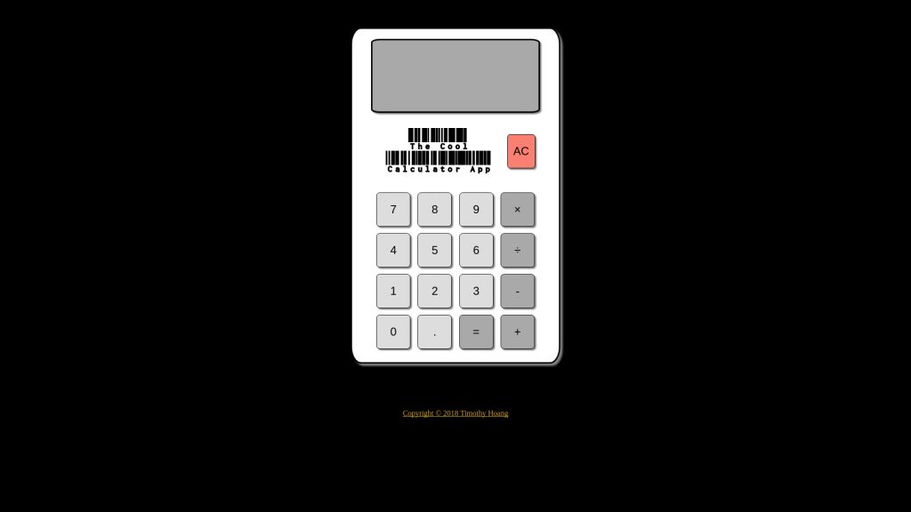
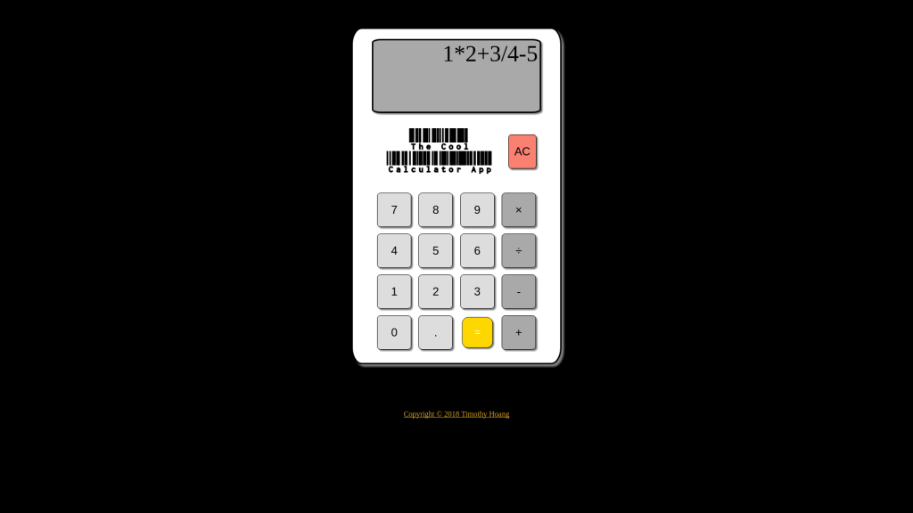
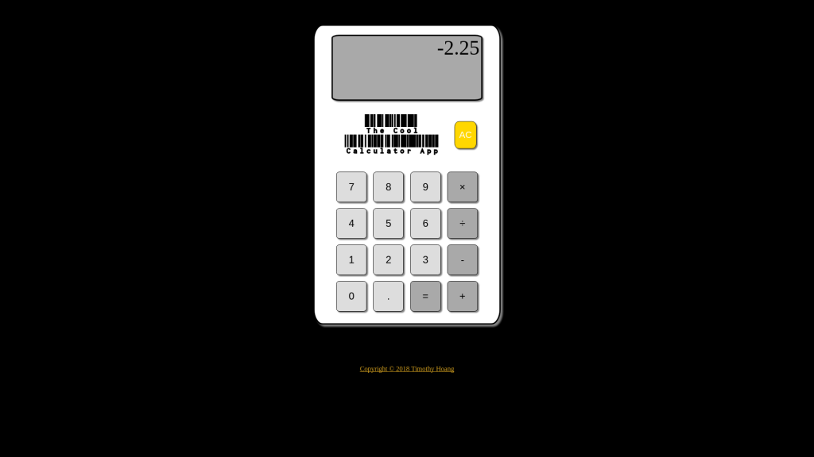

# 0145_cool_calculator_app

## The Cool Calculator App by Timothy Hoang

<figure></figure>

## To view this app online

- To view deployed app, visit: <https://timh1203.github.io/calculator-app>

## To edit the source code

- Github Repo: <https://github.com/timh1203/calculator-app>

1. Have NPM and NodeJS installed on your computer
2. Navigate to the directory of choice and type `git clone https://github.com/timh1203/calculator-app`
3. Alternatively, you can also fork the repo and clone it (no future updates planned)
4. Open up your favorite editor and have fun

## About

- The Calculator App is a basic app that carries out MDAS operations
- This app is designed for anyone and can be used by everyone
- Currently: final stage, no more future updates planned (as of 2/6/2018)

## Features

- Users can carry out operations with order of operations: multiply or divide and addition or subtraction
- Users can also clear the screen and use decimals in calculations
- Users can chain multiple operations on a single screen and also subsequent operations after totaling (equal)
- Users can use their keyboards or mouse to click on the buttons
- Users can enjoy button animate when clicked or keys are pressed for entry recognition

## Minor Features

- Escape key will clear the screen
- Enter key will calculate total
- Other keys (0-9, *, /, +, 0) are mapped as normal

## Technologies

- HTML
- CSS
- JavaScript

## More pictures

### Calculation Step

<figure></figure>

### Result Step

<figure></figure>
